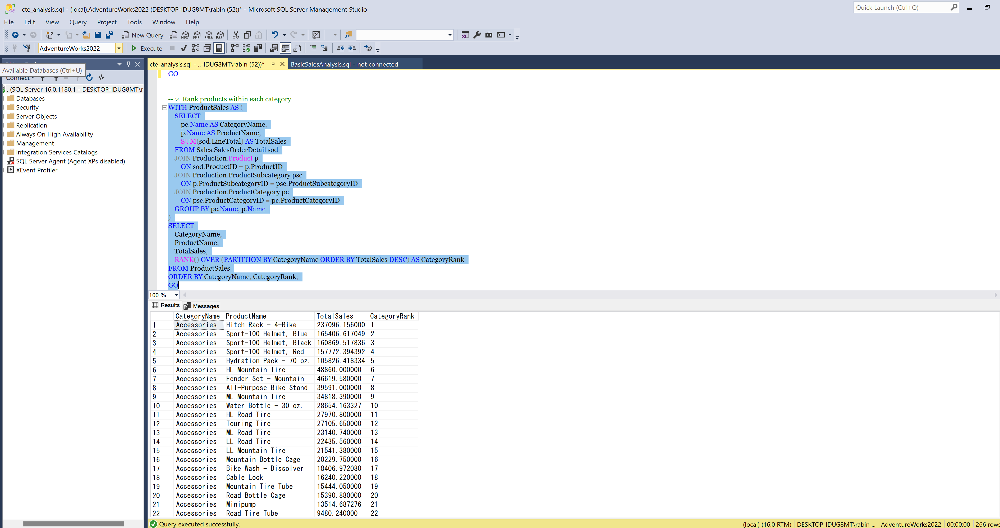

# SQL BI Analytics Portfolio

This repository contains some of the SQL and Business Intelligence projects I’ve been working on while improving my skills in data analytics and reporting.

I created this project using the AdventureWorks2022 database to practice writing real-world SQL queries and build a stronger understanding of how data is analyzed in business environments.

The project includes different types of SQL analysis such as:
- Common Table Expressions (CTEs)
- Window functions
- Views
- Stored procedures
- Sales and customer analysis
- KPI reporting

I also plan to connect this project with Power BI dashboards to visualize the insights and create more complete BI solutions.

---

# What I Learned

Working on this project helped me improve my understanding of:
- Writing cleaner SQL queries
- Breaking complex logic into smaller steps using CTEs
- Using ranking and aggregation functions
- Organizing SQL projects in a more professional way
- Thinking about data from a business perspective instead of only technical queries

One thing I especially focused on was making the queries easier to read and understand instead of just making them work.

---

# Tools Used

- SQL Server
- SSMS
- AdventureWorks2022
- Power BI
- GitHub

---

# Project Structure

SQL/
→ SQL scripts and analysis queries

PowerBI/
→ Dashboard files and screenshots

Images/
→ Query results and dashboard previews

Documentation/
→ Project notes and summaries
```

---

# Sample Analysis Included

## Customer Sales Analysis
Used CTEs and ranking functions to identify top customers by yearly sales.

## Sales Trend Analysis
Analyzed monthly and yearly sales trends to better understand revenue patterns.

## Product Performance Analysis
Explored which products and categories generated the most sales.

---

# Future Improvements

Some things I still want to add:
- More advanced stored procedures
- Query optimization
- Additional Power BI dashboards
- More business KPI analysis
- Data cleaning examples

---

# About Me

I’m currently building my skills in:
- SQL
- Power BI
- Data Analytics
- Business Intelligence Reporting

I enjoy learning through hands-on projects and using data to solve business problems.

Thanks for checking out my project!


# Sample SQL Analysis

## Product Ranking by Category Using CTEs and Window Functions

This query ranks products within each category based on total sales using CTEs and the RANK() window function.


